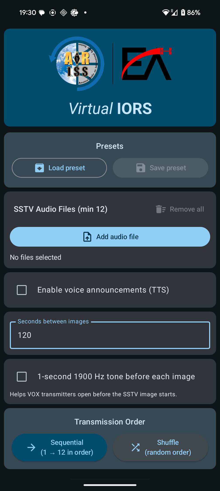
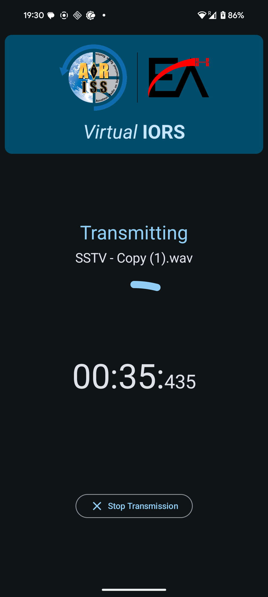

# VirtualIORS

VirtualIORS is an open-source Android application by ARISS-EA Team designed to simulate the ARISS IORS payload on the International Space Station for educational purposes. Currently, it simulates SSTV transmissions in the same way they are done from the ISS. Plus, it adds other features described in [Features](#features).

# Authors

* Alejandro Romero (University of Castilla-La Mancha, Spain)
* Rodrigo Catalán (University of Valencia, Spain)

AI-assisted programming tools were used throughout the development of this project to improve productivity.

## Table of Contents

* [Features](#features)
* [Screenshots](#screenshots)
* [Usage](#usage)
* [Configuration & Presets](#configuration--presets)
* [Permissions](#permissions)
* [Safety Warning](#safety-warning)
* [Getting Started](#getting-started)

    * [Prerequisites](#prerequisites)
    * [Building](#building)
* [Contributing](#contributing)
* [Links](#links)

## Features

* Select and order ≥12 SSTV audio files (`.wav` / `.mp3`) via a multiple-file picker
* Optional TTS announcements:

    * Built‑in TTS engine (on‑device) - beware voice audio level may be low
    * Custom external TTS audio file support
    * Configure when it speaks (every *N* images)
* Shuffle or sequential (like the ISS) playback modes
* Gapless VOX pre‑tone (1s at 1900 Hz) before each image for VOX transmitter keying
* Cooldown interval between images (configurable seconds; warning under 30 s to avoid transmitter overheating and posible damage)
* Named presets management (save, load, delete; includes two demo presets with 12 PD120 and 12 Robot36 format images)

## Screenshots

  
  

## Download

Head to the Releases area in this Repository.
App requires Android version **9.0 or newer**

## Usage

1. Grant requested permissions on first launch.
2. In **SSTV Audio Files**, tap **Add audio file** and select ≥12 SSTV audio files.
3. (Optional) Enable **Voice announcements** and configure:

    * Interval (every N images)
    * Custom audio file or generated TTS phrase
4. (Optional) Enable **VOX pre‑tone** for transmitter keying.
5. Choose **Sequential** or **Shuffle** mode.
6. Set **Seconds between images** (cooldown).
7. Press **Start Transmission** to begin SSTV playback.
8. To stop, tap **Stop Transmission** on the display screen.

## Configuration & Presets

* Save your current settings as a named preset (requires ≥12 audio files).
* Load or delete custom presets via the **Presets** card.
* Two built‑in demo presets:

    * **Demo Robot36** (Robot 36 SSTV mode)
    * **Demo PD120** (PD 120 SSTV mode)

## Permissions

* **Read media / storage** – to select and play SSTV audio and optional TTS files.
* **Record audio** – reserved for future APRS/Voice Repeater features; microphone audio is **never** captured or uploaded.

## Safety Warning

**Intervals below 30 seconds between SSTV images can overheat and permanently damage some RF transmitters. The app displays a live warning if you set the cooldown too short.**

## Getting Started

### Prerequisites

* Android Studio Giraffe or newer
* Android Gradle Plugin as specified in `build.gradle`
* JDK 11 or newer
* Device or emulator running Android 9.0 (API 28) or higher

### Building

1. Clone the repository from Android Studio
2. Open the project in Android Studio.
3. Let Gradle sync and resolve dependencies.
4. Build and run on your target device or emulator.

## Contributing

Contributions are welcome! Feel free to add any bugs or create any pull request with features you think are interesting.

*Note:* We're not fully familiar with all aspects of software engineering, particularly when it comes to merging and managing branches. If you're interested in contributing or supporting us, feel free to reach out at info@ariss-ea.org.

## Links

* ARISS-EA GitHub Profile: [https://github.com/ARISS-EA](https://github.com/ARISS-EA)
* ARISS-EA Website: [ariss-ea.org](https://ariss-ea.org)
