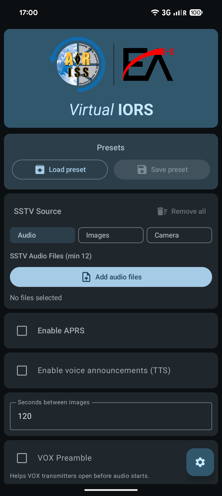
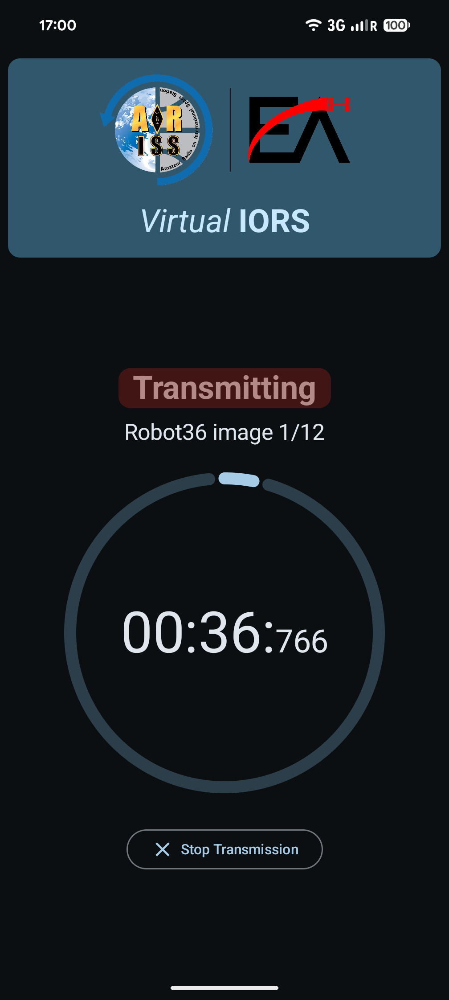

<p align="center">

</p>


# VirtualIORS

[](#)

VirtualIORS is an open-source Android application by ARISS-EA Team designed to emulate the ARISS IORS payload on the International Space Station for educational purposes. It recreates ISS-style SSTV transmissions and adds optional voice and APRS signals for classroom activities, demonstrations and amateur radio activities.

# Authors

* Alejandro Romero (University of Castilla-La Mancha, Spain)
* Rodrigo Catalán (University of Valencia, Spain)

AI-assisted programming tools were used throughout the development of this project to improve productivity.


## Table of Contents

* [Features](#features)
* [Screenshots](#screenshots)
* [Download](#download)
* [Usage](#usage)
* [Configuration & Presets](#configuration--presets)
* [Permissions](#permissions)
* [Safety Warning](#safety-warning)
* [Getting Started](#getting-started)

    * [Prerequisites](#prerequisites)
    * [Building](#building)
* [Acknowledgements](#acknowledgements)
* [Contributing](#contributing)
* [Links](#links)

## Features

* Three ways to prepare an SSTV transmission:

    * **Audio files:** select and order at least 12 compatible SSTV audio files. Use the arrows or drag and drop to arrange them.
    * **Image files:** select pictures and generate Robot36 or PD120 audio on the device. Images are cropped without stretching and may include a callsign and compact image counter. Images can be ordered by using drag and drop or arrow buttons.
    * **Automatic camera images:** take a fresh front- or back-camera picture at each SSTV slot, with Robot36/PD120 crop and an optional callsign/UTC timestamp watermark.
* Optional voice announcements:

    * Use the built-in TTS engine (on-device) or an audio file.
    * Configure when the announcement plays (every *N* images).
* Optional APRS packets generated with a standards-based AX.25/Bell 202 encoder:

    * Beacon, GPS position, mobile telemetry and short text message.
    * Independent interval and packet spacing.
    * Default source `VIORS` and destination `CQ`.
* Shuffle or sequential playback modes. Automatic camera mode always captures in sequence.
* Optional VOX preamble. SSTV and voice use a gapless 1-second 1900 Hz pre-tone; APRS uses a longer AX.25 preamble instead.
* Cooldown interval between images.
* Three built-in image demos: **Demo Robot36**, **Demo PD120** and **Demo APRS**.
* A clear transmission display showing the current signal, what comes next and the remaining time.

## Screenshots

<p align="center">
  
  
</p>


## Download

Head to the Releases area in this repository.
The app requires Android version **9.0 or newer**.

## Usage

1. Open VirtualIORS and follow the short setup screen.
2. Choose **Audio**, **Images** or **Camera** in the SSTV Source card.
3. Add your SSTV files or prepare the automatic camera.
4. Optionally enable **Voice announcements** and choose on-device TTS or a custom audio file.
5. Optionally enable **APRS**. The beacon is always included; GPS, telemetry and text are optional.
6. Set the time between images and choose Sequential or Shuffle when the source supports it.
7. Enable the VOX preamble if your radio interface needs it. APRS will automatically use a longer packet preamble.
8. Press **Start Transmission**.
9. To stop, tap **Stop Transmission** on the display screen.

## Configuration & Presets

* Save the current setup as a named preset and load it again from the Presets card.
* Built-in presets:

    * **Demo Robot36** — 12 local images encoded as Robot36.
    * **Demo PD120** — 12 local images encoded as PD120.
    * **Demo APRS** — Robot36 images with a simple beacon, telemetry and text.
* Callsign, APRS destination and the optional path are kept in **Settings**. Defaults are `VIORS`, `CQ` and an empty path.

## Permissions

VirtualIORS works locally. Selected audio and images stay on the device and are opened through Android system pickers.

* **Camera:** requested only when Automatic Camera Images is opened.
* **Location:** requested only if APRS GPS Position is enabled.

No broad storage permission is required.

## Safety Warning

**Intervals below 30 seconds between SSTV images can overheat and permanently damage some RF transmitters. VirtualIORS shows a live warning when the cooldown is too short.**

Use appropriate audio levels and comply with local amateur-radio regulations before connecting a phone to an RF transmitter. The VOX helper opens compatible transmitters but does not replace correct radio configuration.

## Getting Started

### Prerequisites

* Android Studio with JDK 17
* Android SDK 37
* Device or emulator running Android 9.0 (API 28) or higher

### Building

1. Clone the repository or open the project in Android Studio.
2. Let Gradle sync and resolve dependencies.
3. Build and run on your target device or emulator.

Validation commands:

```bash
./gradlew clean test
./gradlew :app:assembleDebug
```

The project contains the Android app and two pure Kotlin/JVM modules: `:sstvtx-core` for SSTV image encoding and `:aprstx-core` for APRS/AX.25/AFSK generation.

## Acknowledgements

* **SSTV Encoder for Android** by Olga Miller, used as the foundation for parts of the SSTV encoder under the Apache License 2.0.
* **Dire Wolf** by WB2OSZ John Langner, an important APRS/packet-radio implementation and reference.
* ARISS Team and the teachers and radio amateurs who use VirtualIORS in educational activities.

## Contributing

Contributions are welcome! Feel free to report bugs, suggest classroom improvements or open a pull request.

We are still learning some parts of software engineering, particularly around merging and branch management. If you would like to contribute or support the project, please contact us at info@ariss-ea.org.

## Links

* ARISS-EA GitHub Profile: [https://github.com/ARISS-EA](https://github.com/ARISS-EA)
* ARISS-EA Website: [ariss-ea.org](https://ariss-ea.org)
